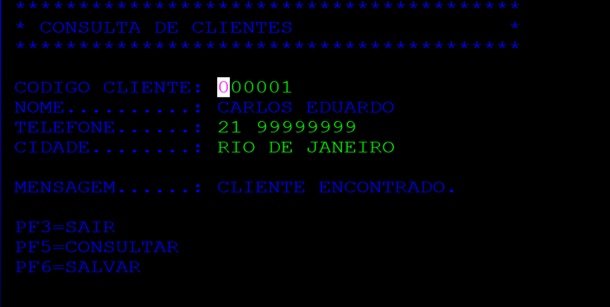
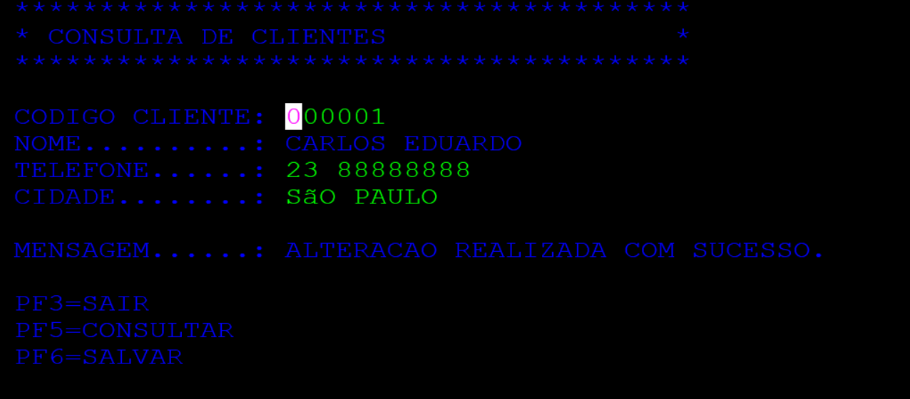

# Projeto: Sistema Online de Gestão de Clientes (CICS/VSAM + COBOL)

Este projeto consiste em uma aplicação online transacional (OLTP) desenvolvida para o ambiente Mainframe IBM MVS 3.8j. O sistema integra a interface de usuário de um terminal 3270 (via mapas BMS) com a lógica de negócios em COBOL 74 e a persistência de dados em arquivos indexados VSAM KSDS, rodando sob a gestão do monitor de teleprocessamento KICKS (clone do IBM CICS).

**Cenário:** Uma central de atendimento precisa consultar e atualizar dados cadastrais de clientes em tempo real. O operador utiliza um terminal "tela verde" para inserir o código do cliente. O sistema vai ao disco físico buscar os dados, apresenta na tela e permite a alteração segura de informações como telefone e cidade.

## Funcionalidades

* **Arquitetura Pseudo-Conversacional:** Uso avançado da instrução CICS `RETURN TRANSID` acoplada à `COMMAREA` para guardar o estado da transação (código do cliente) na memória do Mainframe entre as interações do usuário, liberando recursos do servidor enquanto o operador digita.
* **Mapeamento de Tela (BMS):** Desenvolvimento de interface gráfica nativa para terminais 3270 utilizando *Basic Mapping Support* via código Assembler, garantindo o posicionamento exato de atributos de entrada e saída.
* **Acesso Direto VSAM KSDS:** Leitura (`READ`) e gravação sob demanda (`REWRITE`) em banco de dados indexado por chave primária de 6 bytes, sem necessidade de varredura sequencial.
* **Proteção contra Sobrescrita Nula (MDT):** Implementação de lógica de segurança no COBOL para lidar com o comportamento do *Modified Data Tag* dos terminais 3270. O sistema barra caracteres nulos (`LOW-VALUES`) e espaços em branco vazios na transação, impedindo que campos não editados pelo usuário apaguem os dados íntegros do VSAM.
* **Gerenciamento de Tabelas CICS:** Configuração em baixo nível das estruturas de controle do servidor transacional:
  * **PPT (Program Processing Table):** Registro dos módulos executáveis.
  * **PCT (Program Control Table):** Criação da transação `CLIE`.
  * **FCT (File Control Table):** Mapeamento do arquivo lógico e amarração com a biblioteca física.

## Tecnologias

* **Linguagens:** ANSI COBOL 74 (Lógica Transacional) e IBM Assembler (Definição BMS/Tabelas).
* **Armazenamento:** IBM VSAM KSDS (Key-Sequenced Data Set).
* **Monitor/Servidor:** KICKS for TSO (Emulação de CICS OS/VS).
* **Sistema Operacional:** MVS 3.8j (Executado via emulador Hercules TK5).

## Estrutura do Repositório

* `src/CLIPGM.cbl`: Código-fonte principal COBOL contendo a `PROCEDURE DIVISION` orientada a eventos (`EIBAID`) e comandos `EXEC CICS`.
* `src/MAPCLIE.bms`: Código-fonte Assembler contendo a definição da tela, rótulos e variáveis de interface.
* `jcl/DEFVSAM.jcl`: Script responsável por deletar e definir o *cluster* VSAM via utilitário `IDCAMS` alocando os cilindros de disco.
* `jcl/CARGACLI.jcl`: Processo *batch* (IEBGENER + IDCAMS) utilizado para a carga inicial de dados simulados com layout fixo de 71 bytes no VSAM.
* `jcl/COBCOMP.jcl`: Orquestrador de compilação CICS que processa o mapa BMS, traduz os comandos `EXEC CICS` e realiza o *Linkage Editor* para a biblioteca `KIKRPL`.
* `cics/KIKFCT.asm`: Configuração da *File Control Table* injetando o mapeamento do banco no servidor.
* `assets/`: Pasta contendo evidências visuais do terminal e resultados da execução.


## Como Executar

### 1. Alocar o arquivo VSAM

No ambiente TSO:

```jcl
ALLOC FI(CLIENTES) DA('HERC01.KICKS.CLIENTES') SHR
```

### 2. Iniciar o servidor KICKS

A partir do ISPF (Opção 6):

```jcl
EXEC 'HERC01.KICKSSYS.V1R5M0.CLIST(KICKS)'
```

### 3. Executar a transação

Limpe a tela do terminal (Clear), digite:

```text
CLIE
```

e pressione **Enter**.

### 4. Consultar um cliente

Digite o código de cliente:

```text
000001
```
Pressione **PF5** para buscar os dados.


## Evidências de Execução





## Evidências de Execução

